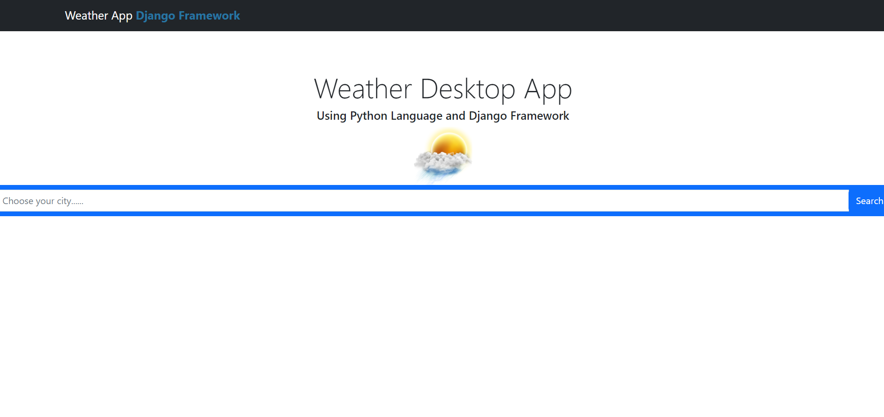
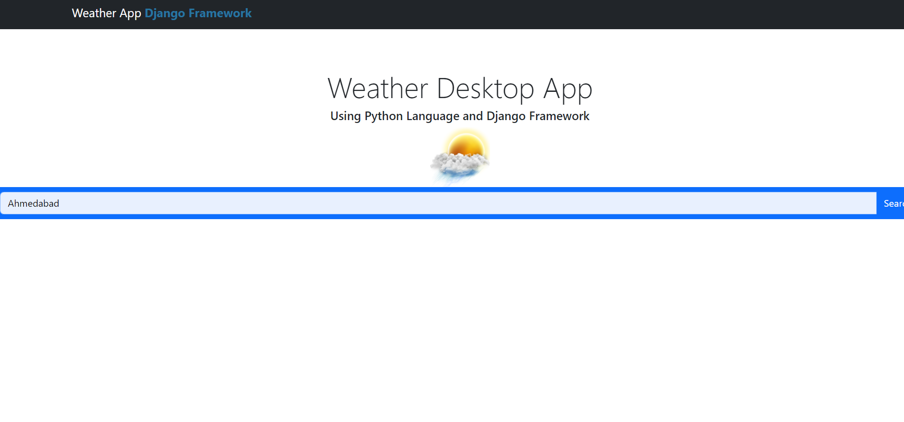
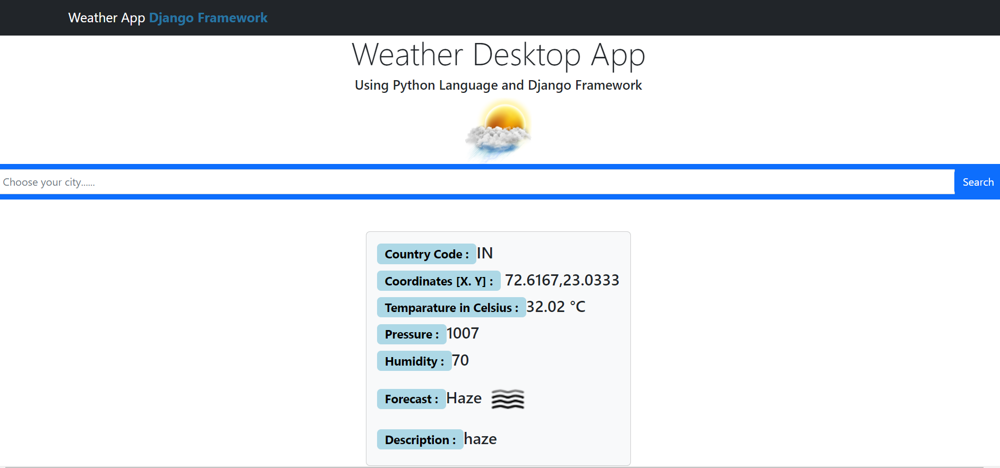

# Weather App

weather App gives the temperature or weather any city in the world. This app is basically build using Django framework. I use the `Weather API` to fetch the data.

### Entering the city name and search:

### We can see the weather of given city:

